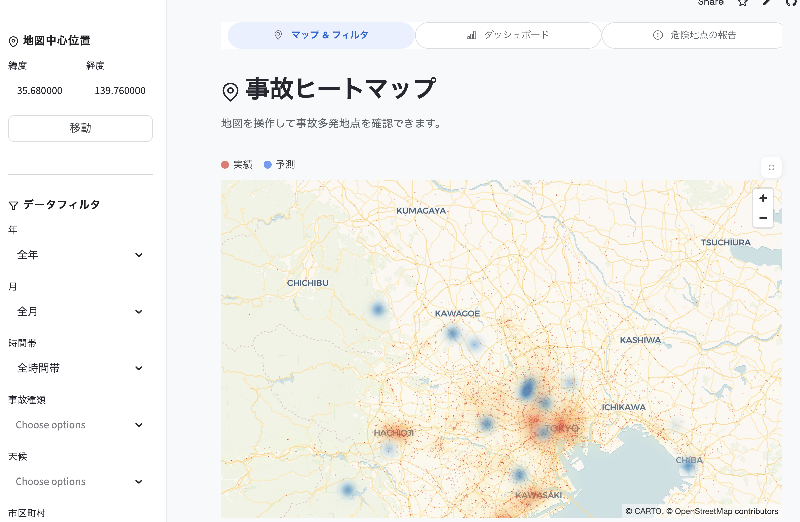

# 物流事故ヒートマップ可視化システム (AccVis)

## 本プロジェクトについて

このプロジェクトは、**LINKS:POWER of DATA x DATA 2025**（国土交通省のオープンデータ活用イベント）用に作成されたアウトプットです。

Project LINKSでは、これまで活用されてこなかった様々な行政情報を「データ」として再構築し、オープンデータとして提供します。このプロジェクトは、新たなデータの潜在的な有用性を引き出すための開発イベントにおいて、交通事故データと人口統計データを組み合わせ、地方住民の安全な道路選択を支援することを目的としています。

---

地方住民が事故多発箇所を把握し、危険な道路を避けるための判断材料を提供するWebアプリケーションです。

**🌐 デモサイト**: https://accvis-8kgi7ue6evmjtajyh2kvyz.streamlit.app/



---

## 機能

### 1. 事故ヒートマップ表示
- Pydeck HeatmapLayerによる事故データの可視化
- インタラクティブな地図操作（ズーム・パン）
- 緯度・経度入力による地図中心の移動
- 直感的なビジュアルデザイン（Google Cloud風UIテーマ）

### 2. 高度なフィルタリング機能
- **時間フィルタ**: 年、月、時間帯（深夜/朝/昼/夜）
- **事故種類フィルタ**: 複数選択可能
- **天候フィルタ**: 複数選択可能
- **道路種別フィルタ**: 高速道路・一般道など
- リアルタイムでヒートマップが更新

### 3. 統計ダッシュボード
- 事故件数の可視化とメトリクス表示
- 事故種別の円グラフ分析
- 天候別・道路種別の事故件数棒グラフ
- 月別・時間帯別の事故推移グラフ
- 人口データとの統合分析

### 4. 事故発生予測（機械学習）
- Random Forestアルゴリズムによる事故発生位置の予測
- 事故種類、天候、車両タイプ、人口から緯度・経度・影響度を予測
- 30の多様なシナリオに基づく予測結果の可視化
- 詳細は[予測モデル](#予測モデルについて)セクションを参照

### 5. 危険地点の要望投稿
- 位置指定（緯度・経度）
- テキスト要望入力
- 画像添付（任意、最大5MB、JPEG/PNG対応）
- CSV形式での保存

## セットアップ

### 必要要件
- Python 3.8以上
- pip

### インストール手順

1. リポジトリをクローン
```bash
git clone <repository-url>
cd AccVis
```

2. 仮想環境を作成（推奨）
```bash
python3 -m venv venv
source venv/bin/activate  # Windowsの場合: venv\Scripts\activate
```

3. 依存パッケージをインストール
```bash
pip install -r requirements.txt
```

4. アプリケーションを起動
```bash
streamlit run app.py
```

5. ブラウザで http://localhost:8501 にアクセス

## データ形式

### 事故データ (data/accidents/)
複数のCSVファイルで構成:
- **data.csv**: メインの事故データ
  - `OCCURRENCE_DATE_AND_TIME`: 発生日時
  - `WEATHER`: 天候
  - `LOCATION`: 場所名
  - `LATITUDE`: 緯度
  - `LONGITUDE`: 経度
  - `ACCIDENT_TYPE_(CATEGORY)`: 事故種類
  - `ROAD_TYPE`: 道路種別
  - `IMPACT`: 事故影響度

- **economic_impact.csv**: 事故の経済的影響データ
  - `Area`: 地域名
  - その他事故詳細情報

- **output_population.csv**: 人口統計データ
  - `市町村`: 市町村名
  - `A6103_流出人口（県内他市区町村で従業・通学している人口）【人】`: 流出人口
  - `lat`, `lon`: 位置情報

- **merged_data.csv**: 事故データと人口データの統合データ（157,482行）

- **predicted_locations.csv**: 機械学習による予測結果データ（30行）
  - `ACCIDENT_TYPE_(CATEGORY)`: 事故種類
  - `WEATHER`: 天候条件
  - `VEHICLE_1:_BODY_TYPE`: 車両タイプ
  - `POPULATION`: 人口
  - `PREDICTED_LATITUDE`: 予測緯度
  - `PREDICTED_LONGITUDE`: 予測経度
  - `PREDICTED_IMPACT`: 予測影響度

### 要望データ (data/requests/requests.csv)
要望投稿時に自動生成されるCSVファイル:
- `request_id`: 要望ID
- `timestamp`: 投稿日時
- `latitude`: 緯度
- `longitude`: 経度
- `description`: 要望内容
- `address`: 住所（任意）
- `image_path`: 画像パス（任意）

## プロジェクト構造

```
AccVis/
├── app.py                    # メインアプリケーション
├── config.py                 # 設定定数
├── requirements.txt          # 依存パッケージ
├── .gitignore               # Git除外設定
│
├── data/                    # データディレクトリ
│   ├── accidents/           # 事故データ
│   │   ├── data.csv                  # メイン事故データ
│   │   ├── economic_impact.csv       # 経済的影響データ
│   │   ├── output_population.csv     # 人口統計データ
│   │   ├── merged_data.csv           # 統合データ
│   │   └── statistics.csv            # 統計データ
│   └── requests/            # 要望投稿データ
│       ├── requests.csv
│       └── images/          # 投稿画像
│
├── src/                     # ソースコード
│   ├── __init__.py
│   ├── data_loader.py       # データ読み込み
│   ├── filters.py           # フィルタリング
│   ├── map_components.py    # 地図描画
│   ├── request_handler.py   # 要望投稿処理
│   ├── statistics.py        # 統計計算処理
│   ├── styles.py            # UIスタイル定義
│   └── utils.py             # ユーティリティ
│
├── scripts/                 # スクリプト
│   └── generate_statistics.py  # 統計データ生成
│
├── dataclean/              # データクリーニング
│   └── predict_accident_locations.py  # 事故位置予測スクリプト
│
├── .streamlit/              # Streamlit設定
│   └── config.toml
│
└── docs/                    # ドキュメント
    └── 要件定義.md
```

## 使い方

### 地図の操作
1. サイドバーの「地図中心位置」で緯度・経度を入力
2. 「地図中心を移動」ボタンをクリック
3. 地図上でマウスホイールでズーム、ドラッグでパン操作

### フィルタリング
1. サイドバーの「データフィルタ」セクションで条件を選択
2. ヒートマップが自動的に更新される
3. 「フィルタをリセット」で初期状態に戻る

### 要望投稿
1. サイドバーの「危険地点を報告する」ボタンをクリック
2. 位置情報と要望内容を入力
3. 必要に応じて画像をアップロード
4. 「送信する」ボタンで投稿

## 技術スタック

- **フレームワーク**: Streamlit 1.32.0+
- **地図可視化**: Pydeck 0.8.0+
- **データ処理**: Pandas 2.2.0+
- **画像処理**: Pillow 10.3.0+
- **UI拡張**: streamlit-option-menu 0.3.0+
- **データシリアライゼーション**: pyarrow 14.0.0+

## デプロイ

このアプリケーションはStreamlit Cloudにデプロイされています。

**デモサイトURL**: https://accvis-8kgi7ue6evmjtajyh2kvyz.streamlit.app/

### Streamlit Cloudへのデプロイ手順

1. GitHubリポジトリにプッシュ
2. [Streamlit Cloud](https://streamlit.io/cloud)にログイン
3. "New app"をクリック
4. リポジトリとブランチを選択
5. メインファイルとして `app.py` を指定
6. Deployをクリック

## 予測モデルについて

このシステムでは、過去の事故データを用いた機械学習モデルにより、特定の条件下での事故発生位置と影響度を予測しています。

### アルゴリズム
**Random Forest Regressor（ランダムフォレスト回帰）**を採用

Random Forestは複数の決定木を組み合わせた強力なアンサンブル学習アルゴリズムで、以下の利点があります:
- 高い予測精度
- 過学習の抑制
- 非線形な関係性の学習が可能
- 欠損値や外れ値に対する頑健性

### 予測モデルの構成

3つの独立したRandom Forestモデルを使用:

1. **緯度予測モデル** (`model_lat`)
   - 目的: 事故発生の緯度を予測
   - パラメータ: n_estimators=100, max_depth=20

2. **経度予測モデル** (`model_lon`)
   - 目的: 事故発生の経度を予測
   - パラメータ: n_estimators=100, max_depth=20

3. **影響度予測モデル** (`model_impact`)
   - 目的: 事故の影響度（被害規模）を予測
   - パラメータ: n_estimators=200, max_depth=20

### 入力特徴量

モデルは以下の4つの特徴量を使用:

1. **事故種類** (`ACCIDENT_TYPE_(CATEGORY)`)
   - 例: 正面衝突、追突、横転など
   - LabelEncoderで数値化

2. **天候条件** (`WEATHER`)
   - 例: 晴れ、雨、雪、霧など
   - LabelEncoderで数値化

3. **車両タイプ** (`VEHICLE_1:_BODY_TYPE`)
   - 例: 乗用車、トラック、バスなど
   - LabelEncoderで数値化

4. **人口** (`POPULATION`)
   - 該当地域の人口数
   - 数値データとして直接使用

### 予測出力

1. **予測緯度** (`PREDICTED_LATITUDE`)
   - 事故が発生する可能性が高い緯度

2. **予測経度** (`PREDICTED_LONGITUDE`)
   - 事故が発生する可能性が高い経度

3. **予測影響度** (`PREDICTED_IMPACT`)
   - 事故の被害規模の推定値

### モデル性能

モデルの評価指標（MAE: 平均絶対誤差）:
- **緯度誤差**: 約0.XXXXXX度（距離換算: 約X.XX km）
- **経度誤差**: 約0.XXXXXX度（距離換算: 約X.XX km）
- **影響度誤差**: 約X.XXX（影響度単位）

※実際の数値は[predict_accident_locations.py](dataclean/predict_accident_locations.py)を実行して確認できます。

### データ分割

- **訓練データ**: 80%（モデル学習用）
- **テストデータ**: 20%（性能評価用）
- random_state=42で再現性を確保

### 予測シナリオの生成

30の多様な予測シナリオを生成:
- 事故種類、天候、車両タイプをランダムに組み合わせ
- 人口は実際のデータの25-75パーセンタイル範囲内から選択
- 予測結果は `data/accidents/predicted_locations.csv` に保存

### 実行方法

```bash
cd dataclean
python predict_accident_locations.py
```

実行後、以下が生成されます:
- `data/accidents/predicted_locations.csv`: 30件の予測結果
- コンソールにモデル性能と予測サンプルが表示

### 技術的詳細

- **実装**: Python + scikit-learn
- **前処理**: 欠損値削除、カテゴリカル変数のエンコーディング
- **並列処理**: n_jobs=-1で全CPUコアを活用
- **再現性**: 各所でrandom_state=42を設定

詳細なコードは[dataclean/predict_accident_locations.py](dataclean/predict_accident_locations.py)を参照してください。

## 主な特徴

- **リアルタイム更新**: フィルタ変更時に即座にヒートマップが更新
- **レスポンシブデザイン**: 様々な画面サイズに対応
- **高パフォーマンス**: 大規模データセット（15万行以上）の高速処理
- **直感的なUI**: Google Cloud風のモダンなデザイン
- **データ統合**: 事故データと人口統計データの統合分析
- **AI予測**: 機械学習による事故発生位置と影響度の予測

## ライセンス

MIT License

## 作成者

AccVis Development Team
